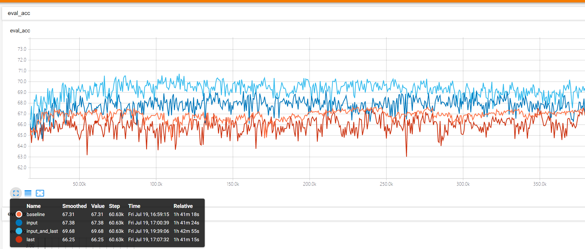
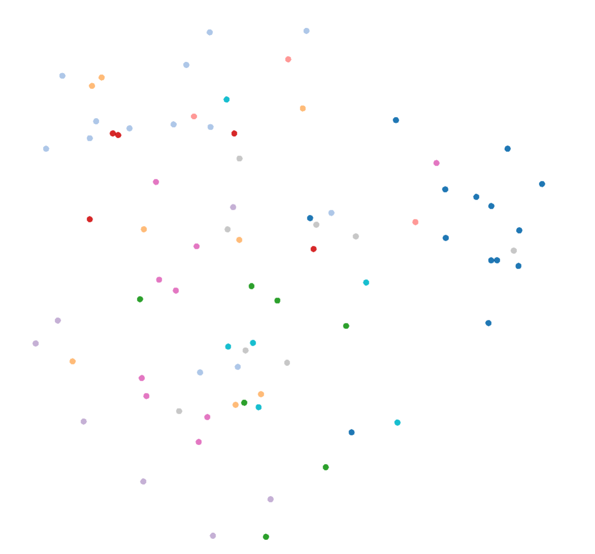
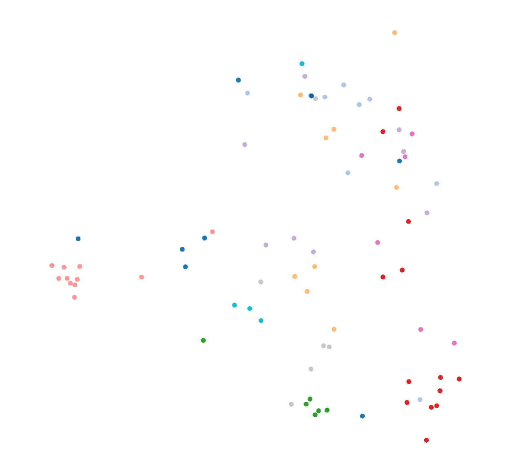

# mixbatch
The mixbatch act as a interpolate to feature space, to make a soft decition margain to enhance generalization.
And the good part is, you can apply mixbatch on any layer you like, any.

- 这种少样本学习的增强方法可以跟NAS很良好地结合，从而获得很好的效果，因为NAS经常也是在少样本上面进行网络搜索的

## mixbatch性能解释
- mixbatch可以在输入以及最后的dense进行应用
- mixbatch通过提供特征空间和输入空间的插值，可以更清晰和稳定地描述分类边界，并生成更多随机样本，防止过拟合
- 使用CIFAR10，测试集作为训练集，训练集作为测试集，mixbatch可以提升ResNet50网络的达3%，训练时间相同
  
- 使用mixbatch后，feature的集中性以及边界会更清晰，下面可视化的是最后一层dense的PCA：  
  baseline:
  

  最后一层做了mixbatch，注意观察灰蓝色那个类，被归到更小的地方去了，显著改善了集中度：
    

  虽然最后一层做了mixbatch的性能并不是最好的，但是可以通过这个例子看出mixbatch是怎样影响模型的输出的，从而，我们可以得出mixbatch能更好地描绘样本点之间的分界面的结论。
  

## TODO
auto-adjust alpha of mixup layer:
- with train noise of layer?
- with grad?
- with linear schedule of epoch?

## NNI启示
- mixbatch，最好是放在input，其次是放在网络的后面，提特征的那几层/block最好不要动
- 放前面的时候，要用较低的alpha，也就是说混合的比例更保持原样，放后面的时候，要使用更高的alpha
- 越往后，alpha越高，混淆越多

